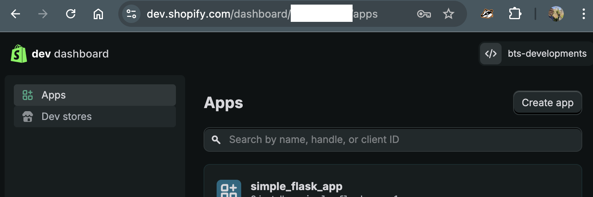
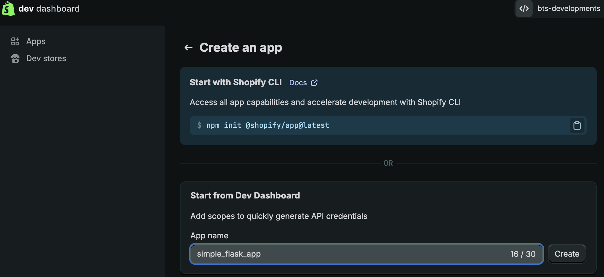
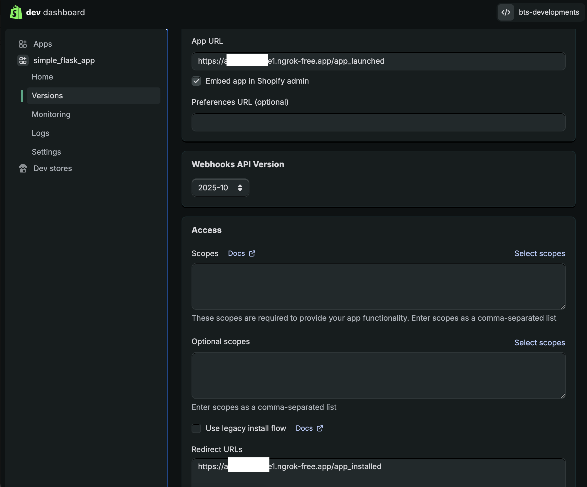
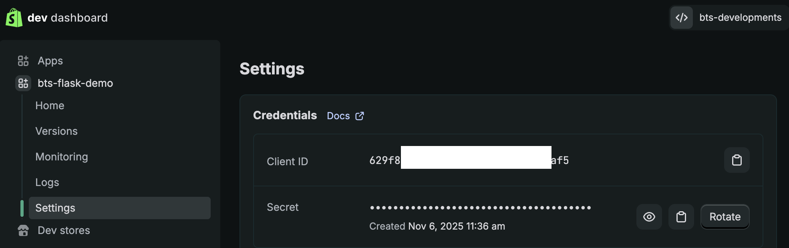
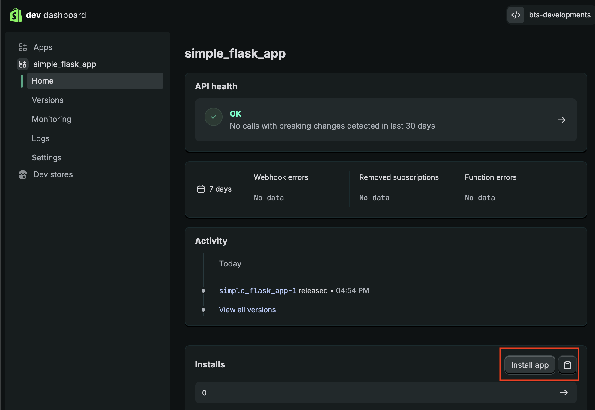
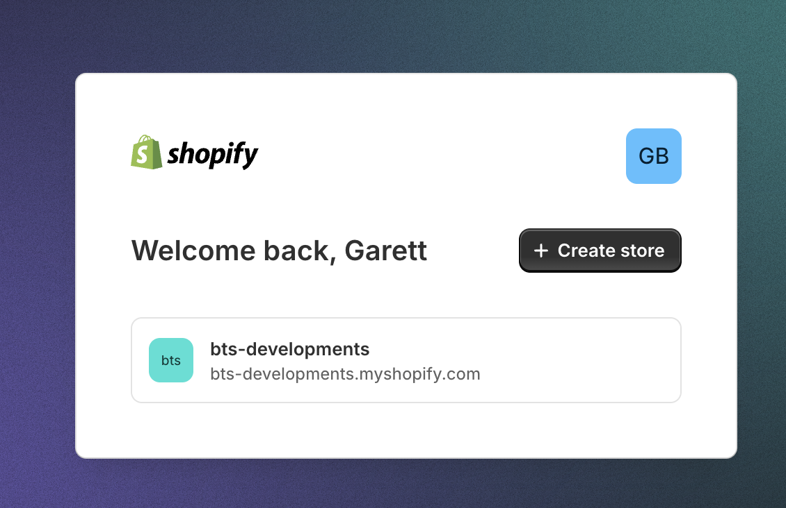
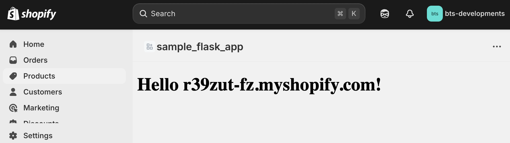

# A Simple Flask Shopify App

I created this extremely simplistic, but hollistic, app for Shopify using Flask to help you learn the basics of the process. I recently created my first Shopify app and while the documentation from Shopify was great, I found it tough to fully grok the entire process. I found many community examples to be somewhat opinionated or built more as an SDK, which are great for some but I prefer a more basic approach, learning a very barebones understanding of the mechanics of the entire app lifecycle, so that's what I focused on for this project.

## What does this sample do?

Very simply, this sample will create the server-side component for your Shopify app and provide you some basic tools which you can build on to create a ~~more~~ robust commercial application.

## Setup
1. Install dependencies
```
pip3 install -r requirements.txt
```

2. Run the app locally. If you are located in the root directory:
```
python3 src/server.py
```
Leave this running. If new changes fail to appear, restart the server.

3. Set up [ngrok](https://ngrok.com/) by installing it and running it locally.
```
ngrok http 5000
```
Throughout the development process, ngrok should be running in the background. You will not need to restart this, as you will generate a new URL.

4. Set up your Shopify app, following [these](https://github.com/garettB/shopify-flask-example#app-creation) steps.

5. Create a local `.env` file by copying over the template
```
cp .env.template .env
```

6. Fill out your `.env` file using your Shopify API key and Shopify secret key. Replace `your_server.hostname` with your ngrok base URL. Do not put quotations around the values.

7. Install the app onto a Shopify test store by following [these](https://github.com/garettB/shopify-flask-example#ready-to-test) steps. If you do not have one, create one.

8. You should be redirected to the admin dashboard of your test store. The url should be formatted as follows
```
https://{{store_name}}.myshopify.com/admin/apps/{{app_name}}/app_launched
```


### `server.py`

This file is the Flask interface, it is where I defined all (4) of the supported web calls. This file receives calls both from the basic Shopify web lifecycle calls as well as webhooks that your app may be listening to. This file stores shop access tokens and nonces in memory, for a production application you'll want to use a more long-lived solution, like a database.

I will break down how this file works more in the [Walkthrough](https://github.com/garettB/shopify-flask-example#walkthrough) section of this README.

### `helpers.py`

This file contains some basic supporting functions, such as those used to validate the web and webhook calls received by `server.py` and to generate our redirect URLs (again, explained more down below).

### `config.py`

This is where you will place your app-specific configuration values. For a production application **DO NOT** keep your sensitive values (i.e. `SHOPIFY_SECRET`, `SHOPIFY_API_KEY`) in your source code, I included them in the source for simplicity.

### `shopify_client.py`

Despite my naming, this is not a very good Shopify client but it is basic and straightforward, hopefully you can take the mechanics and build it into a client of your own.


# Walkthrough

Before you get too far, you'll need to host your app somewhere so Shopify can hit it. If you want something quick and easy, I recommend [ngrok](https://ngrok.com/), it lets you setup a server on your computer and provides a randomized URL that can be reached from the Internet.

## App Creation

Whatever you use to host your app, make sure you can browse to it in a web browser (https://<hostname>/app_launched). You should receive a big ugly **Bad Request** error, that's expected. For now copy the <hostname> value into the `config.py` file for the `SERVER_HOSTNAME` variable. Now let's open the Shopify Partner's doashboard and create our app:



We'll select a Public App for this example, but feel free to use a Private App if you need:



Next give your app a name and enter the URLs for your web server, `https://<hostname>/app_launched` for the App URL and `https://<hostname>/app_installed` for the Whitelisted redirection URL:



Copy the name you gave your app to the `APP_NAME` variable in the `config.py` file (NOTE: replace spaces with hyphens, so "my test app" should be assigned to `APP_NAME` as "my-test-app"). 

Now click that purple "Create App" button at the top of the page.

Your app is now created, and you will be presented with your API Keys on this next page. Copy the API key and API secret key to the `SHOPIFY_API_KEY` and `SHOPIFY_SECRET` variables in the `config.py` file (respectfully):


Your `config.py` file is now fully configured! You should now restart the app so the new values are loaded to your server.

## Ready to test? 

Testing is pretty easy, but I'll break down what's happening behind the scenes. 

The first thing to do is to "Test your app" in a store you have created which "Install" the app to that store. In functional terms, selecting one of your stores will cause Shopify to generate a URL to your web app that includes information about the store that is installing the app and a bunch of parameters that your app can use to validate that the link was actually created by Shopify and not some nefarious third-party. Click the 'Select Store' button then choose which store you'd like to use to test against:



At this point Shopify will actually redirect the browser to your server (`https://<hostname>/app_launched`) using the scheme I just described above. Walk through the `server.py` file's #app_launched function to get a feel for what's happening. 

The first thing you may notice is that the function has a wrapper, @helpers.verify_web_call, this takes all the query parameters attached to the URL and validates its integrity. I abstracted the logic for verifying the request to the `helpers.py` file to keep the server more straightforward, but in short we use a secret that only you and Shopify know (`SHOPIFY_SECRET`) to check that Shopify was the one that created the URL.

Now that we trust the data, we can use it to see if we already have an `ACCESS_TOKEN` for the user (on first launch we do not), if we don't then it means the user hasn't yet authorized our app to be registered/installed against their store, so we need to bump them back to Shopify with our list of demands (`ACCESS_MODE`, `SCOPES`) to get full user consent for the actions our app will need access to. We also include in the URL a link back to our web app for when the user chooses to proceed with the installation (see #helpers.generate_install_redirect_url for more details on this URL).

Now, click the "Install unlisted app" button:



Shopify redirects the user, again, to our server, this time to the `https://<hostname>/app_installed` URL. Once our server receives this call we know the app installation/registration has completed and can now generate an `ACCESS_TOKEN` that is associated to this specific store and bound by the `SCOPES` we defined. We will also register a webhook against Shopify so we get notified when the user uninstalls the app from the store (lets us know to clean up anything if needed, or just for tracking). Once the `ACCESS_TOKEN` is generated we bump the user back to the main Shopify app page which is in the Shopify admin apps section, and will load our `https://<hostname>/app_launched` URL in a frame, although this time since we have an `ACCESS_TOKEN`, we will render our welcome page:



### Uninstallation and Data Removal Requests

I mentioned above that the app will by default register a webhook to get notified if the app gets uninstalled. It's important to note that when this happens the `ACCESS_TOKEN` is no longer valid, so can be discarded, you will generate a new token if the user re-installs the app. When this webhook gets hit it is a good time to remove anything about the shop that you no longer need to hang onto, and handle whatever emails, notifications etc in your process for when a customer leaves.

Shopify mandates that your app implement several webhooks to handle customer data removal requests. You set the webhook URLs in the app settings within the Partner portal, so I skipped the step, but I did give you a stub function within `server.py`, #data_removal_request, where you can implement the logic to read what request was received, then action on it.

## Conclusion

That's it, you've successfully created your first Shopify app using Python and Flask! Congrats! 

I hope you found this sample app helpful. If I messed anything up, just let me know and I will try to resolve as soon as I can, I'm also open to contributions. 

I used the APACHE 2.0 license which is very liberal, feel free to use any of the code in this project, I don't require attribution but would love to know if you found it helpful:
[@garettbeuk](https://twitter.com/garettBeuk)

